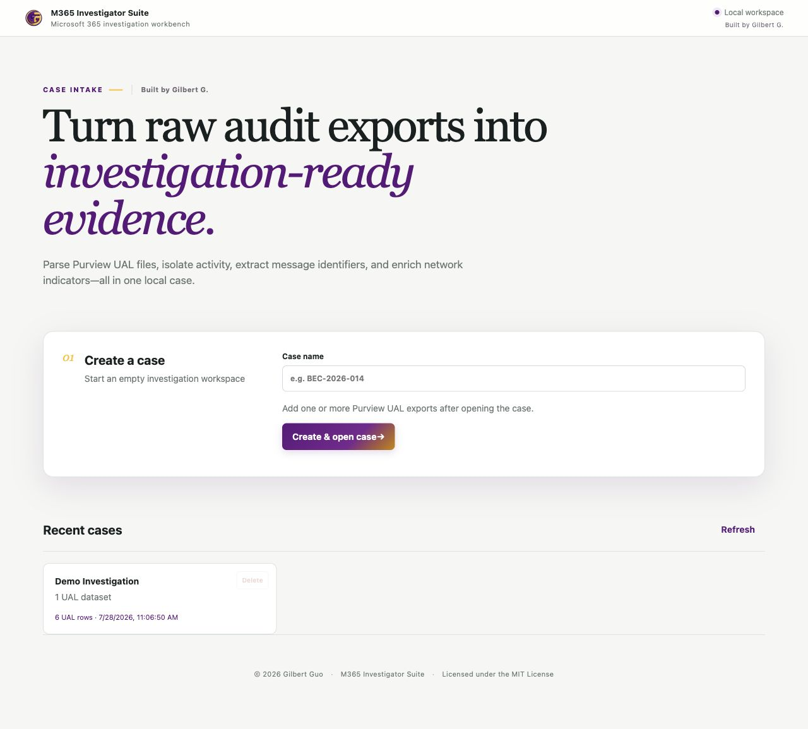
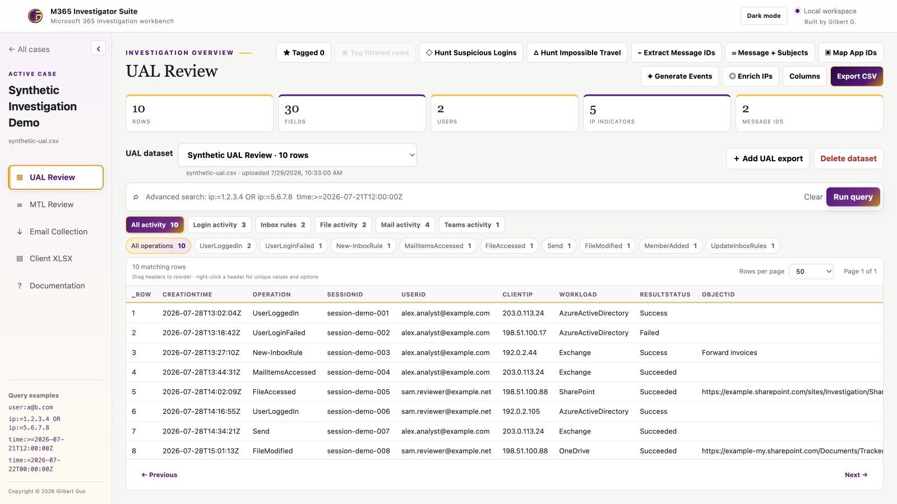
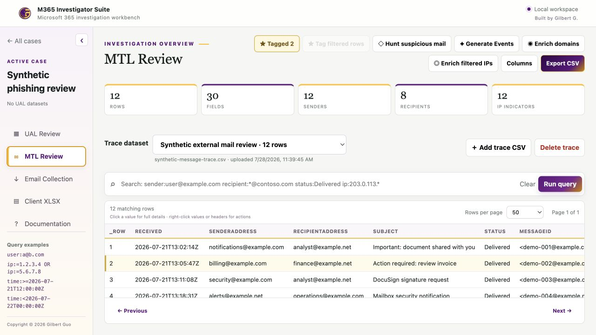
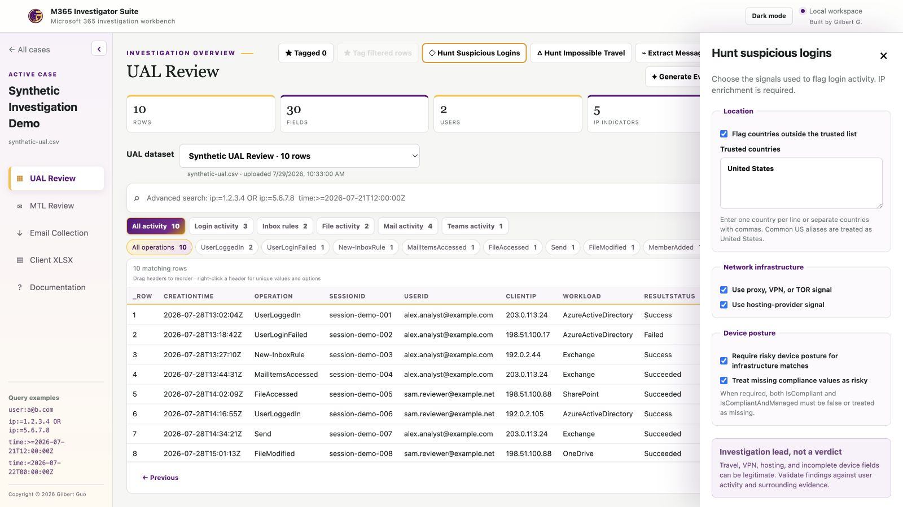
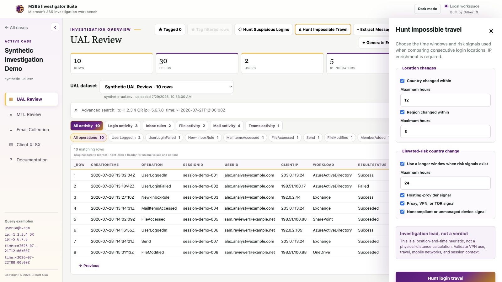
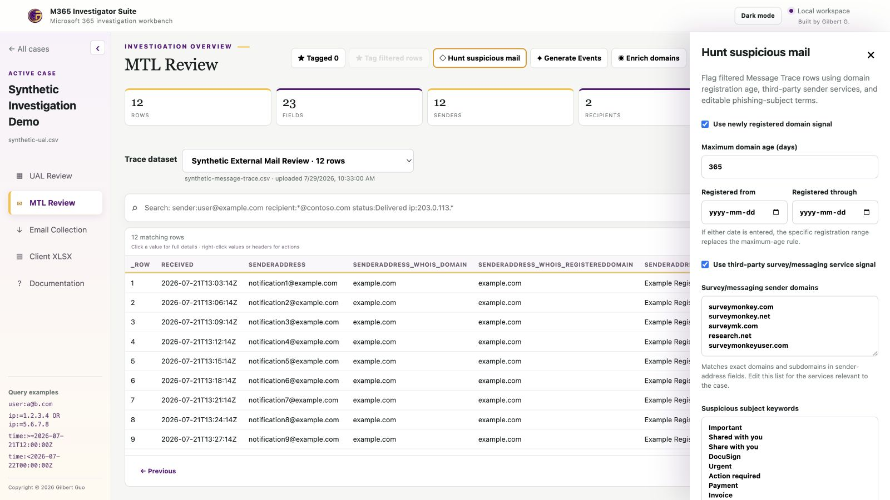

# M365 Investigator Suite

<p align="center">
  
</p>

<p align="center">
  A local, case-based workbench for Microsoft 365 audit logs, Message Trace investigations, enrichment, email collection, and analyst-ready exports.
</p>

<p align="center">
  <a href="https://medium.com/@gyw765419384/introducing-m365-investigator-suite-a-local-first-workbench-for-microsoft-365-investigations-952093aef4ca">Read the introduction on Medium</a>
</p>

<p align="center">
  <a href="https://buymeacoffee.com/gilbertguo"></a>
</p>

> [!IMPORTANT]
> Hunting results are investigation leads, not final determinations. Validate findings against the original evidence and surrounding context.

## Key features

| Area | Capabilities |
| --- | --- |
| Case management | Independent local cases with multiple UAL and Message Trace datasets |
| UAL Review | Parse Purview CSV, Excel, JSON, and JSONL exports; flatten `AuditData`; categorize Logon, Inbox Rules, Transport Rules, Mailbox Permissions, Email Access, File Access, and Other operations |
| MTL Review | Parse Exchange Message Trace CSV files, including common UTF-16 exports; manage multiple traces per case |
| Search and review | Field queries, wildcards, `AND`/`OR`, exclusions, empty values, time ranges, unique-value filters, sorting, paging, draggable/frozen columns, and full-value inspection |
| Investigation workflow | Persistent row tags, bulk tagging of filtered results, message-ID and subject extraction, a deduplicated two-column MessageIds/Subjects CSV, Microsoft app-ID mapping, and tracker-ready Event narratives |
| Enrichment | Filter-scoped IP intelligence and domain-registration enrichment with persistent results and in-drawer progress indicators |
| Hunts | Suspicious logins, impossible travel, newly registered domains, suspicious subjects, and review-worthy third-party mail services |
| Collection and export | Authorized Microsoft Graph email collection, customizable filtered CSV export, and client-shareable XLSX preparation |

## Screenshots

All screenshots use synthetic identities and reserved documentation IP ranges.

### Case intake



### UAL Review



### MTL Review



### Configurable hunts

#### Suspicious Login



#### Impossible Travel



#### Suspicious Mail



## Quick start

Requirements: Python 3.9 or newer, including Python 3.13, and a modern browser.

```bash
git clone https://github.com/GilbertGuo/M365-Investigator-Suite.git
cd M365-Investigator-Suite
python3 -m venv .venv
source .venv/bin/activate
python3 -m pip install --upgrade pip
python3 -m pip install -r requirements.txt
python3 app.py
```

Open <http://127.0.0.1:8765>, create a case, then add one or more UAL or Message Trace CSV exports from inside that case.

Windows activation:

```powershell
.venv\Scripts\Activate.ps1
python app.py
```

Case evidence and derived analysis are stored under `cases/`. This directory is excluded from Git except for its placeholder.

## Typical workflow

1. Create a case.
2. Add UAL exports in **UAL Review** and Message Trace files in **MTL Review**.
3. Filter, inspect full values, review unique values, sort columns, and tag records of interest.
4. Enrich only the filtered IPs or domains needed for the investigation.
5. Run the relevant hunt and inspect its reason, risk, and score columns.
6. Generate concise Event narratives for a tracker.
7. Export the complete filtered result as CSV or create a client XLSX workbook.

## Query examples

```text
user:alex@example.com
ip:64.*
operation:*Login*
result:failed
Login.DeviceName:=""
ip:=1.2.3.4 OR ip:=5.6.7.8
user:alex@example.com AND result:Success
time:>=2026-07-21T12:00:00Z AND time:<2026-07-22T00:00:00Z
```

- `*` matches any number of characters.
- `:=` performs an exact match; `Field:=""` matches blank or missing values.
- Prefix a condition with `-` to exclude it.
- `AND` binds more tightly than `OR`; parentheses can group expressions.
- Timestamp columns support `>`, `>=`, `<`, and `<=`.
- Right-click values and timestamps to build filters without typing the query.

## IP and domain enrichment

IP enrichment adds Country, Region, City, ISP, AS, Mobile, VPN/TOR, and Hosting fields to the filtered rows.

- **Anonymous free IP-API:** non-commercial use only and transmitted over HTTP after the analyst accepts the notice.
- **Commercial IP-API:** enter a Pro key in the password field; requests use HTTPS. The key is used only for the active request and is not saved, returned, or placed in browser storage.
- Private, loopback, link-local, and invalid addresses are classified locally.
- Domain enrichment sends extracted domain names—not complete email addresses—to public RDAP services over HTTPS.

Review [Third-Party Notices](THIRD_PARTY_NOTICES.md) before enabling external enrichment.

## Email collection

**Email Collection** can retrieve authorized messages by mailbox UPN and InternetMessageId through Microsoft Graph. It supports manual targets or a CSV containing:

```text
MailboxOwnerUPN,InternetMessageId
analyst@example.com,<message-id@example.net>
```

The analyst supplies the tenant ID, client ID, client-secret value, and an absolute output folder. Microsoft Graph application permission `Mail.Read` requires administrator consent and can provide broad mailbox access. Use written authorization, restrict the application where possible, and revoke temporary secrets or permissions after collection.

## Local-first security model

- The server listens on `127.0.0.1` by default.
- It has no built-in user authentication, TLS termination, or multi-user isolation.
- Do not expose the built-in server directly to the internet or an untrusted network.
- Protect `cases/` and collection output folders as evidence repositories.
- Source evidence, common deliverables, credentials, caches, and local environment files are excluded through `.gitignore`.

## Testing

```bash
python3 -m unittest discover -s tests -v
```

## License

Copyright © 2026 Gilbert Guo.

The source code is licensed under the [MIT License](LICENSE). Third-party services, reference data, product names, and trademarks remain subject to their respective owners and terms. See [Third-Party Notices](THIRD_PARTY_NOTICES.md).
